# AWS Lambda Security Demo

This project demonstrates the end-to-end process of configuring IAM credentials, creating a secure Lambda function, and invoking it successfully. Each step is documented with CLI commands and proof snapshots to highlight troubleshooting, correction, and final success.

---

## 1. Identity & Credentials
- Verified AWS account identity  
  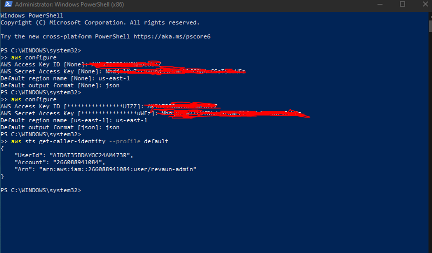

- Correctly configured access keys  
  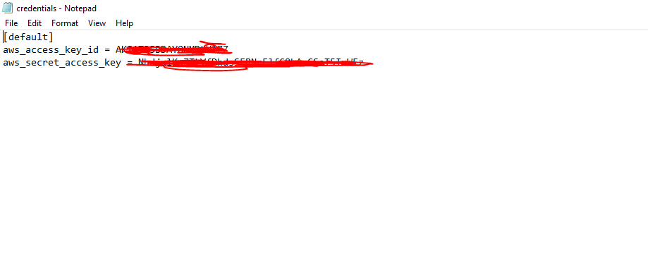

- Example of misconfigured credentials (troubleshooting proof)  
  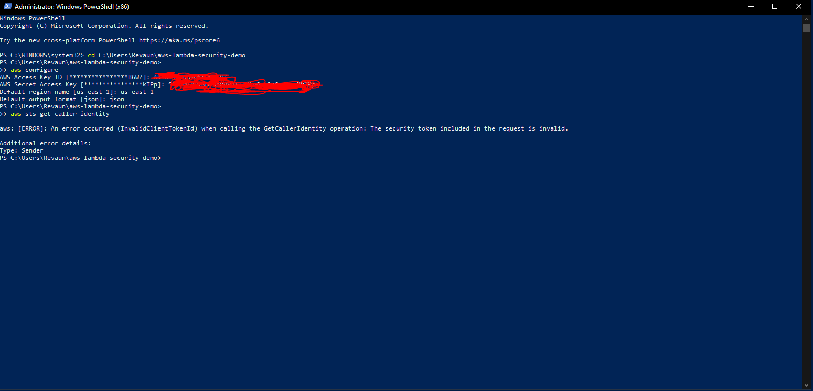

- Console view confirming active key status  
  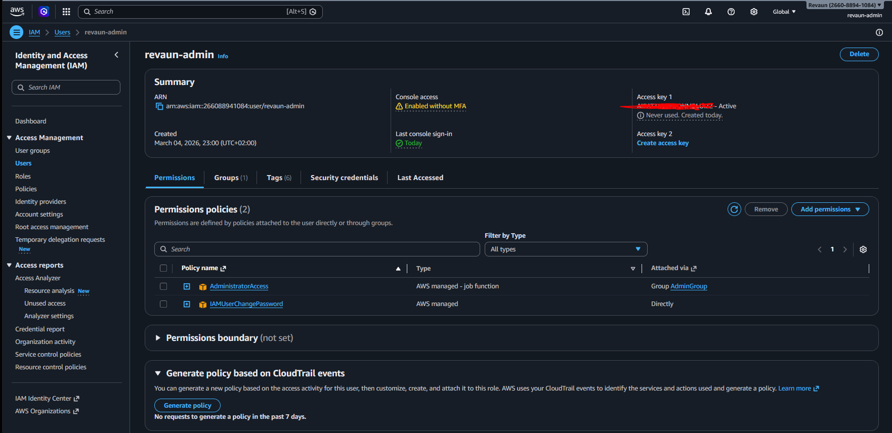

---

## 2. IAM Role & Policy
- Attached IAM policy JSON  
  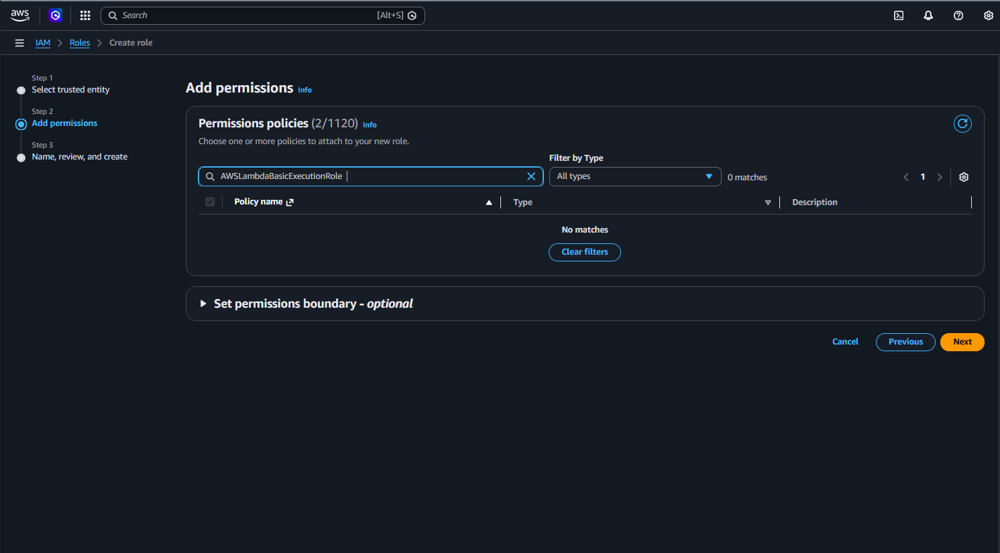

- Role ARN for `lambda-basic-execution-r014`  
  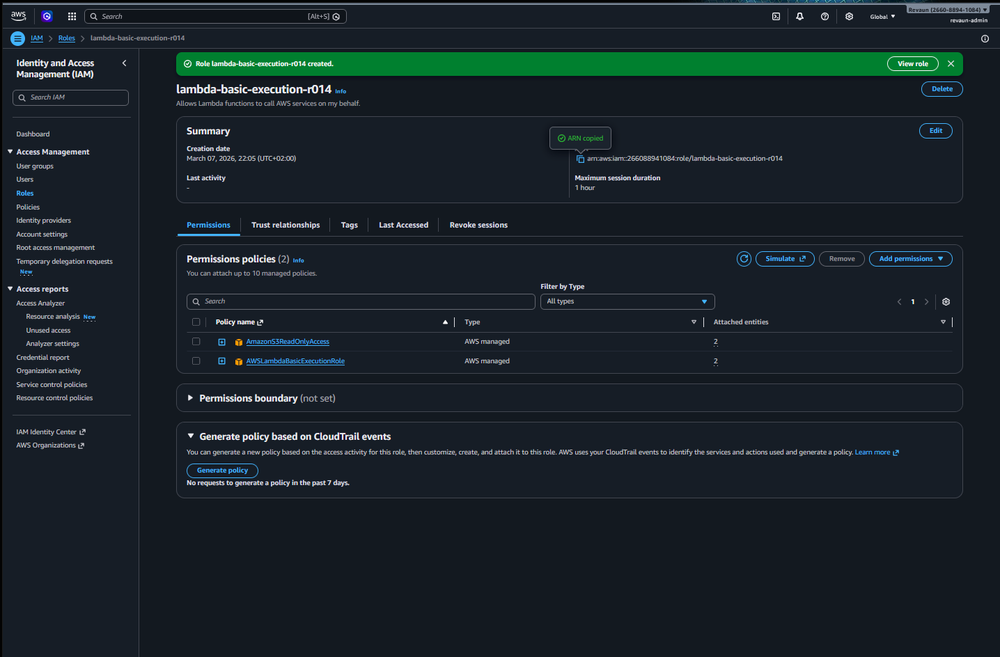

- Trust relationship showing `lambda.amazonaws.com` as the trusted entity  
  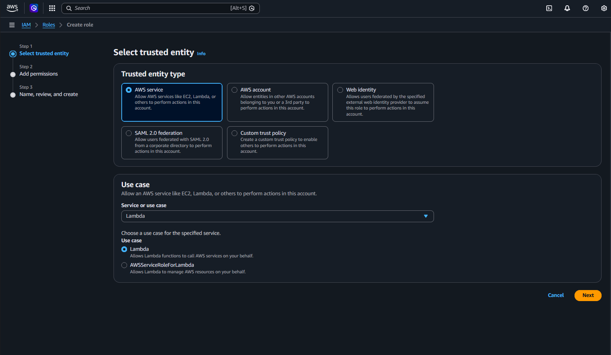

---

## 3. Lambda Deployment
- Python handler code (`lambda_function.py`)  
  

- Updated ZIP archive containing the handler  
  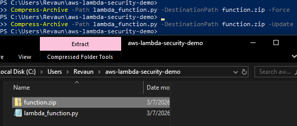

- CLI run for function creation  
  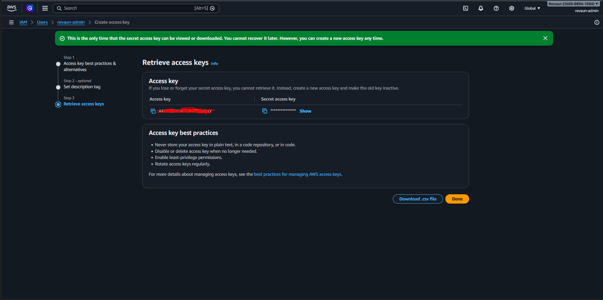

- Successful Lambda creation output  
  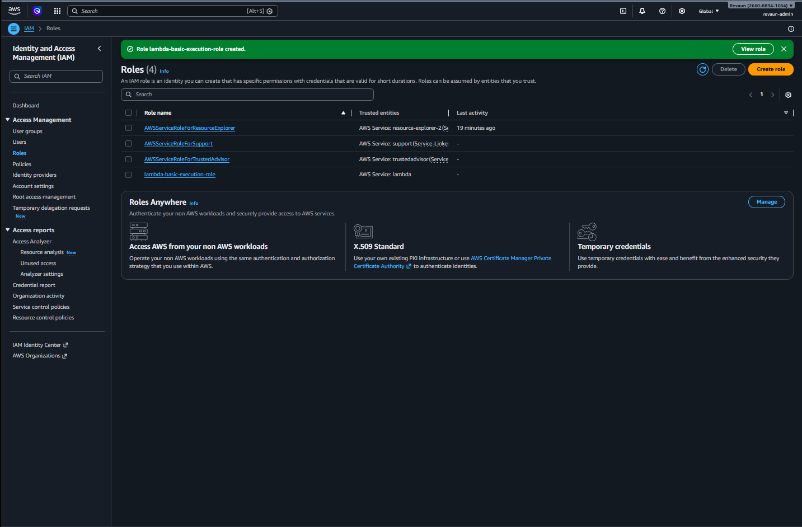

- Corrected JSON output from CLI  
  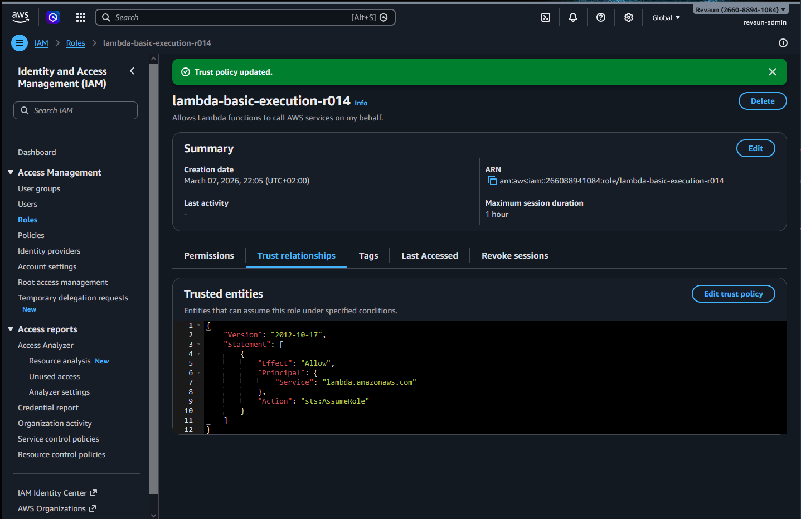

- Console confirmation of active Lambda function  
  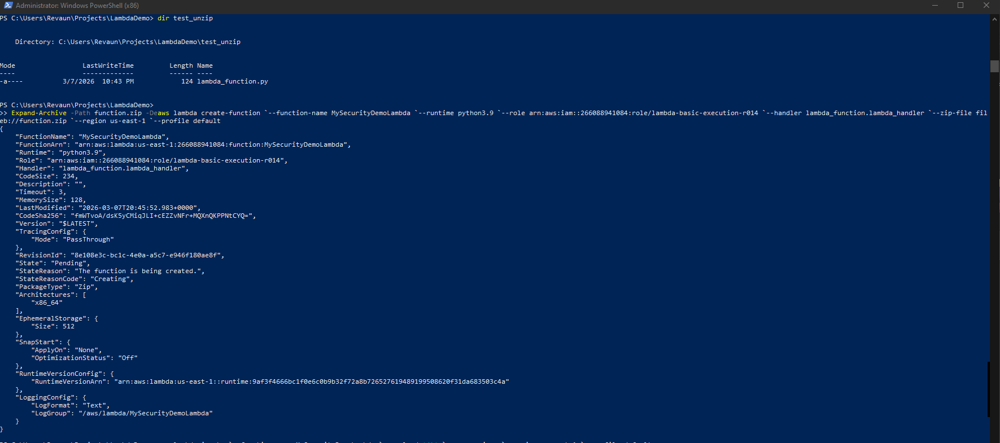

---

## 4. Lambda Execution
- CLI invoke command run  
  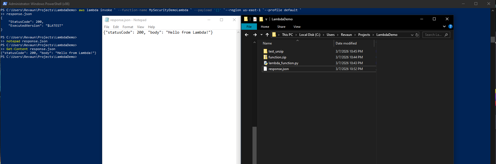

- Output file showing:
  ```json
  {
    "statusCode": 200,
    "body": "Hello from Lambda!"
  }


---

5. Commands Used
Identity & Credentials

aws sts get-caller-identity --profile default

---


IAM Role & Policy


aws iam create-role --role-name lambda-basic-execution-r014 --assume-role-policy-document file://trust-policy.json
aws iam attach-role-policy --role-name lambda-basic-execution-r014 --policy-arn arn:aws:iam::aws:policy/service-role/AWSLambdaBasicExecutionRole


---

Lambda Deployment

Compress-Archive -Path lambda_function.py -DestinationPath function.zip -Force

aws lambda create-function `
  --function-name MySecurityDemoLambda `
  --runtime python3.9 `
  --role arn:aws:iam::266088941084:role/lambda-basic-execution-r014 `
  --handler lambda_function.lambda_handler `
  --zip-file fileb://function.zip `
  --region us-east-1 `
  --profile default

---

Lambda Execution

aws lambda invoke `
  --function-name MySecurityDemoLambda `
  --payload '{}' `
  --region us-east-1 `
  --profile default `
  response.json

---

✅ Outcome

This demo proves:

    Secure IAM role setup with trusted entity.

    Correct packaging of Python handler into a ZIP.

    Successful Lambda deployment via AWS CLI.

    Verified execution with output captured in response.json.
---

Snapshots demonstrate troubleshooting, correction, and final success. The sequence highlights hands-on AWS CLI usage, IAM security awareness, and Lambda deployment skills — all critical for Cloud Security Engineer roles.

---


